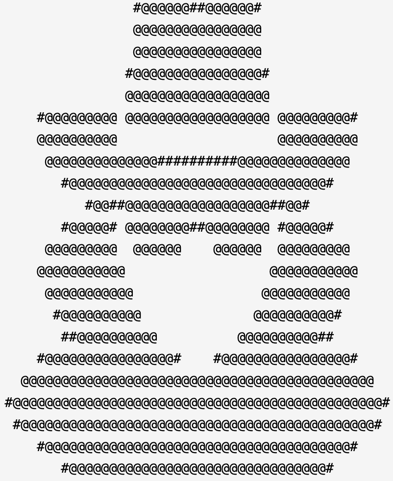

<p align="center" style="text-align: center;">
  
</p>
<div align="center">

# uncle

> Governed CI for coding agents.

> Everyone else is building agents that run unsupervised. This is the approval
> layer that makes them acceptable in production.

</div>

uncle is a human-gated, adversarially-audited CI pipeline for AI-generated
code. A primary agent plans, implements, and verifies; an independent reviewer
audits it adversarially; you approve at every gate. By default `cline` runs
every stage, on both sides.

- **Human approval gates** at every planning and review stage.
- **Adversarial review** by a second model that did not write the code.
- **SHA-256 pinned specs** so approved artifacts cannot be silently modified.
- **Immutable reviewer-owned files** the implementing agent cannot edit.
- **A green check and a diff gate** after implementation, run by the driver
  rather than by the agent that wrote the code.

Use it when the cost of an agent silently shipping the wrong thing is higher
than the cost of waiting for a human to say yes.

> **Just testing uncle?** Use Cline with open-weight models and configure your plan.
> Expect slower runs, but dramatically lower costs than premium models billed
> per token—a good tradeoff while trying out the workflow.

---

## Usage

1. Install Uncle.
2. Create a `REQUIREMENTS.md`, `CHANGE_REQUEST.md`, or GitHub issue.
3. Run `uncle`.

## Install

Install directly from GitHub. The bootstrap selects Homebrew on macOS, apt on
Debian/Ubuntu (including WSL), and Scoop on Windows. Have Homebrew or Scoop
installed first; on Linux, apt installs the bootstrap dependencies using sudo.
Agent CLIs and account authentication remain separate prerequisites.

**macOS, Linux, or Git Bash on Windows:**

```sh
curl -fsSL https://raw.githubusercontent.com/unclehq/uncle/main/install.sh -o install.sh
bash install.sh
```

**Windows PowerShell:**

```powershell
Invoke-WebRequest -UseBasicParsing https://raw.githubusercontent.com/unclehq/uncle/main/install.ps1 -OutFile install.ps1
powershell -NoProfile -ExecutionPolicy Bypass -File .\install.ps1
```

Both installers default to `main`. Select a GitHub branch, tag, or commit with
`--ref` (PowerShell: `-Ref`); select a public fork with `--repo OWNER/REPO`
(PowerShell: `-Repo OWNER/REPO`). Each install resolves the ref to a commit.
Homebrew and Scoop verify a SHA-256 checksum of that commit's downloaded archive.
Use `--dry-run` / `-DryRun` to inspect the selected route without installing.
The chosen ref must contain the installer files.

| Platform | Package installed | Update | Uninstall |
|---|---|---|---|
| macOS | Homebrew formula in the generated `unclehq/github-install` tap | Rerun `install.sh` with the desired ref | `brew uninstall unclehq/github-install/uncle` |
| Debian/Ubuntu/WSL | Locally built `uncle` `.deb`, installed with apt and its declared dependencies | Rerun `install.sh` with the desired ref | `sudo apt remove uncle` |
| Windows | Scoop package in the generated `uncle-github` bucket | Rerun `install.ps1` with the desired ref | `scoop uninstall uncle` |

The generated tap and bucket retain the selected revision; they do not follow
GitHub changes until the installer is rerun. The apt route builds from GitHub
and installs a local package, so no separate apt repository is required.
Switching an existing Homebrew or Scoop installation from another tap/bucket
may require uninstalling that package first. Project `.uncle` state lives in
your projects and is not part of the installed package.

To use Homebrew's GitHub source directly without the bootstrap:

```sh
brew tap unclehq/uncle https://github.com/unclehq/uncle.git
brew install --HEAD unclehq/uncle/uncle
```

For local development, run `bash install.sh --source-dir "$PWD"`, or
`.\install.ps1 -SourceDir $PWD` in PowerShell, from a checkout. This includes
local edits. See [packaging documentation](packaging/README.md) for package
builds and platform validation.

## Prerequisites

Install these tools in the environment where you run Uncle: macOS, Linux, or
Windows with WSL/Git Bash. Commands must be available on that shell's `PATH`.
Use Homebrew on macOS, apt on Debian/Ubuntu, or [Scoop](https://scoop.sh) on Windows.

| Tool | Needed for | Installation notes |
|---|---|---|
| Bash 3.2+ (`bash`) | Workflow scripts | Included with macOS and most Linux distributions; use WSL or Git Bash on Windows. |
| Git (`git`) | Source diffs and review gates | Install through your platform's package manager. |
| Python 3 (`python3`) | The terminal UI, verification, and workflow helpers | Installed by each package; Homebrew uses `python@3.13`. |
| jq (`jq`) | Agent event streams and JSON processing | Installed by each package. |
| curl (`curl`) | Installer download, HTTP requests, and public GitHub issue fallback | Included with macOS and Git Bash; use `sudo apt install curl` if missing on Linux. |
| An agent CLI: `cline`, `claude`, `kimi`, or `codex` | Planning, implementation, and independent review | Install and authenticate every runner selected in Configure. The default configuration uses `cline`; these CLIs are installed separately from Uncle. |
| GitHub CLI (`gh`) | Authenticated GitHub issue and pull-request workflows | Installed by each package. Run `gh auth login` before using authenticated GitHub features. |

Package managers install tools, but they do not authenticate GitHub or agent
accounts. Configure the selected agent CLIs with their required
account or API credentials and model access before starting a workflow. They
also need network access to their providers.

### macOS — Homebrew

For a source checkout, install the core tools yourself:

```sh
brew install git jq python@3.13 gh
```

If `python3` is not available afterward, follow `brew info python@3.13` to add
its command directory to your `PATH`.

### Linux — apt (Debian/Ubuntu)

```sh
sudo apt update
sudo apt install bash git python3 python3-venv jq curl gh
```

These commands install dependencies, not Uncle itself. If your distribution
cannot locate `gh`, follow the [GitHub CLI Linux installation instructions](https://github.com/cli/cli/blob/trunk/docs/install_linux.md).
Other Linux distributions can install equivalent packages with their package
manager.

### Windows — Scoop or WSL

For native Windows installation, install [Scoop](https://scoop.sh) in a normal
user PowerShell session, then run `install.ps1` above. The generated package
installs Git (including Git Bash), Python, jq, and GitHub CLI through Scoop.
Its `uncle` shim launches Bash and supplies the `python3` command required by
Uncle's helpers. For the full-screen menu, install curses support into Scoop's
Python with:

```powershell
python -m pip install windows-curses
```

Alternatively, use WSL to run the Linux package. In an administrator PowerShell:

```powershell
wsl --install
```

Restart when prompted, open Ubuntu, and follow the Linux install steps inside
WSL. Install and authenticate your agent CLIs inside WSL as well. Linux Python
does not need `windows-curses`. See
[Microsoft's WSL installation guide](https://learn.microsoft.com/en-us/windows/wsl/install).

### Project-specific tools

Optional tools depend on the project:

| Tool | When to install it |
|---|---|
| `glow` or `bat` | To render approval documents in the terminal; otherwise Uncle shows plain text. |
| Language runtimes, compilers, and package managers | When the project's build or approved test commands require them, such as Node.js for a JavaScript project. |
| A browser and browser-test dependencies | When acceptance includes browser checks. The test environment must also permit local server sockets and browser execution. |
| PDF tools such as Poppler (`pdftotext`, `pdftoppm`) | When the project requires PDF extraction or rendered PDF comparison. |

The project's preflight stage checks its specific tools, versions, source
files, and required reviewers. Install those prerequisites before implementation
so repair attempts are not spent on missing tools or unavailable permissions.

Without curses support, `uncle` falls back to a line-based menu.

---

## Run it

```sh
cd /path/to/your/project
uncle
```

That is the whole interface. The first run in a project opens the Configure
screen, which lists every stage of the pipeline. Open a stage and you pick the
runner that drives it, its reasoning effort, and — only when that runner is
cline — the model it runs; claude, kimi, and codex are given no model and use
their own default. Settings are saved per stage to `.uncle/config` in that
project. Later runs go straight to the menu:

| Menu item | You provide | What happens |
|---|---|---|
| **New application** | `REQUIREMENTS.md` | Plans and builds a project from a requirements brief. |
| **From GitHub issue** | an issue number or URL | Seeds the right workflow from the issue, then runs it. |
| **Change request** | `CHANGE_REQUEST.md` | Baselines, specs, plans, and implements a change to an existing codebase. |
| **Configure stages** | — | Per-stage runner, effort, and cline model. |

Runners are per side. An agent stage — which writes code — can run on `cline`,
`claude`, `kimi`, or `codex`; a reviewer stage, which must stay read-only, on
`cline`, `codex`, or `claude`. The same runner is not the same thing on both
sides: codex runs `--sandbox workspace-write` as an agent and
`--sandbox read-only` as a reviewer, and that is enforced by the shim, not by
the prompt.

Both pipelines are resumable. Interrupt one and re-run `uncle` — it picks up
where it stopped, from `.uncle/workspace/` in your project. That directory is
the only thing uncle adds to your tree.

---

## The gates

Each stage produces one document and stops. uncle asks whether to approve it
in a box in the middle of the screen: `y` continues, anything else pauses the
run and exits cleanly, and `v` opens the document itself — through `glow` or
`bat` when either is installed.

An approval records the SHA-256 of the exact bytes you read. Downstream stages
re-hash the file and refuse to run if it changed, so editing an approved
document sends it back to its gate.

After implementation there are two checks the implementing agent does not
control: the driver re-runs the verification commands from the document you
already approved — comparing them against the pre-change baseline, for a
change request — and then shows you the real diff. A regression turns that
approval into an explicit, recorded override. A final audit that does not say the change is ready stops the run.

Runs end in `READY`, `READY WITH NON-BLOCKING ISSUES`, or `NOT READY`.

For new applications, a prerequisite check runs before implementation. It
verifies access to the tools, browsers, source inputs, and reviewers required
for acceptance. Missing prerequisites pause the run. Approved verification
commands must cover the full automated acceptance suite, including browser
tests when applicable.

After the code gate, an independent test review checks coverage, assertions,
expected results, and evidence that critical tests reject representative
defects. Failed reviews or acceptance checks return to repair, then repeat the
driver checks, human diff approval, test review, and checklist. Two repair
attempts are allowed across restarts by default (`WORKFLOW_MAX_REPAIRS`, 0–100).
At the limit, a session popup (or terminal prompt) lets you enter a higher total
limit or stop with the run pending. Increases are saved in
`.uncle/workspace/repair-limit` across restarts; no answer authorizes no extra work.
Missing evidence or external prerequisites pauses verification instead of
consuming repair attempts. Final audit starts only after required checks pass;
an implementation green-check override does not waive acceptance.

The updated plan also names protected tests, fixtures, helpers, and test
configuration. The driver hashes these files and directory inventories before
verification and rejects changes even when commands report success. Repairs
may change tests, but must explain each change and pass another diff approval
and independent test review. This detects changed inputs at stage boundaries;
it does not make an agent with filesystem access physically unable to edit them.

---

## Performance

To inspect runtime and reported token usage for the current project:

```sh
uncle --performance
```

The report separates agent/reviewer attempts, approval waits, driver checks,
and integrity checks. Stage runtime includes the model and its tool calls;
missing token usage is shown as unknown. Records accumulate across repairs and
restarts, so compare attempts as well as elapsed time when tuning stage effort.
Reviewer model and effort choices in Configure are passed to the reviewer CLI.

Independent checks can run concurrently when their positions are listed in an
approved `Parallel verification groups` plan section. Concurrency defaults to
two workers (`WORKFLOW_VERIFY_JOBS=1` forces sequential execution; maximum 8).
Ungrouped checks remain sequential. Protected inputs are checked around each
command, and the driver retains separate exit statuses and logs.

Integrity hashing uses one Python process when available, with the complete
portable shell implementation as a fallback. The terminal redraws on changes
instead of on every idle poll. These optimizations preserve the acceptance gates.

Before requirements analysis or planning, both workflow drivers perform a local
prerequisite check. It detects local files explicitly named by an instruction
such as “Use `resume.pdf` as the authoritative source.” Missing or empty inputs
stop the stage before launching an agent. This intentionally narrow check does
not infer every dependency from prose or replace the full preflight.

For other required inputs and tools, declare `.uncle/prerequisites.json`:

```json
{"files": ["resume.pdf"], "commands": ["pdftotext", "pdftoppm", "pdfinfo"]}
```

Files must be repository-relative; commands are executable names checked on PATH,
never shell expressions. The gate reruns on each planning attempt, so adding an
input or installing a tool clears the corresponding blocker without a reset.
Revised plans retain unaffected content and resolve findings through focused
edits. Prompts use the calculated budget as the single byte limit and suggest
an 85% drafting target to leave room for corrections.

Every document-producing stage receives a per-file budget, checked before the
workflow advances. This includes background reviews, implementation steps,
repairs, and acceptance reports. Defaults are:

Defaults use the UTF-8 byte size of `REQUIREMENTS.md` for new builds and
`CHANGE_REQUEST.md` for change workflows. Missing or empty input uses the floor;
this does not waive source prerequisites. Shared artifacts use the active workflow's
source even when both inputs exist. Standalone new-build helpers use requirements.

| Documents | Source multiplier | Byte floor–ceiling | Line floor–ceiling |
|---|---:|---:|---:|
| Requirements interpretation | 1× | 4,000–20,000 | 160–160 |
| Change spec | 1× | 4,000–8,000 | 160–160 |
| Plans and revised plans | 2× | 6,000–24,000 | 150–600 |
| Baseline, checklists, test and verification reports | 2× | 4,000–16,000 | 120–480 |
| Adversarial/test reviews, final audit | 2× | 4,000–12,000 | 120–360 |
| Implementation notes, preflight, defects | 1× | 2,000–8,000 | 60–240 |

Bytes are source size times the multiplier, clamped to the listed bounds.
Lines scale with the resulting byte budget relative to its floor, rounded up
and capped at the listed ceiling. Explicit budget overrides still take precedence.

These are ceilings, not output targets. Stages cite settled upstream requirements
and existing evidence instead of repeating them. Exact acceptance assertions,
commands, protected paths, finding dispositions, and required result rows remain
complete. Source code, raw logs, and driver-generated diff/evidence files are not
limited by document budgets. Generated output never increases the next budget.

Oversized reviewer output gets one editorial compaction pass using the same
read-only reviewer, with a 120-second timeout. It shortens the existing review
without redoing repository analysis. The original and candidate are archived in
`.uncle/workspace/logs/review-compact-*/`; only a candidate within budget that
preserves headings, finding IDs, table rows, severity/status lines, inline code,
numeric references, fenced commands and verdict can replace it. These are
structural safeguards, not proof of semantic equivalence: human review remains
required. Compaction attempts have separate performance records.

Set `WORKFLOW_REVIEW_COMPACT=0` to disable this pass, or
`WORKFLOW_REVIEW_COMPACT_SECONDS` to a timeout from 1 to 600 seconds. If it fails,
the original stays in place and the stage pauses; there is no automatic loop.
Other oversized artifacts also pause without advancing.

Completed adversarial plan reviews are saved under
`.uncle/workspace/review-cache/` before compaction. A retry reuses that result only
when the review prompt (excluding budgets), local input snapshot, Git HEAD, and
reviewer settings match. Increasing a byte/line cap does not require a new review.
A failed speculative compaction pauses immediately instead of falling through to
another full review. A manual retry may retry compaction on the saved review.
Use `WORKFLOW_REVIEW_CACHE=0` to request a fresh review. This cache is limited to
plan reviews; test reviews and final audits still gather fresh evidence. Symlinks
or input snapshots over 100 MB disable caching conservatively. Logs and workflow
state are excluded from snapshots; source files and project configuration are not.
Old reviews without a saved input snapshot cannot be safely reused automatically.

Remove repeated prose before retrying, or increase the limit when mandatory
content needs more room. Environment overrides apply globally via
`WORKFLOW_DOC_MAX_BYTES` / `WORKFLOW_DOC_MAX_LINES`, or to one artifact via its
uppercase filename without `.md` (replace dots/hyphens with underscores):

```sh
WORKFLOW_DOC_MAX_BYTES_VERIFICATION_REPORT=12000 uncle
```

Per-artifact overrides take precedence over global overrides. These are launch
environment variables, not Configure fields. Existing approved documents are not
automatically rewritten, and checks are never dropped to fit a budget.


## Documentation

- [`QUICK_START.md`](QUICK_START.md) — end-to-end in a few minutes.
- [`REQUIREMENTS.md`](REQUIREMENTS.md) — the requirements-brief template.
- [`CHANGE_REQUEST.md`](CHANGE_REQUEST.md) — the change-request template.
- [`OUTPUT_RULES.md`](OUTPUT_RULES.md) — the shape every document a stage
  writes for you to review must have.
- [`lib/gates/GATES.md`](lib/gates/GATES.md) — the output gates every plan must
  satisfy.
- [`AGENTIC.md`](AGENTIC.md) — the design philosophy behind the gates.
- [`CLAUDE.md`](CLAUDE.md) — the agent instruction contract.
- [`scripts/README.md`](scripts/README.md) — the drivers, their stages, and
  every configuration variable, for running stages by hand.
- [`CONTRIBUTING.md`](CONTRIBUTING.md) — the contributor guide.
- [`CODE_OF_CONDUCT.md`](CODE_OF_CONDUCT.md) — before participating.

Open an issue to discuss larger changes before spending time on them.

### Cost accounting

`uncle --performance` shows input, output, cached and total tokens for model
stages, plus reported dollar costs. Unavailable costs are labeled `Unavailable`;
non-model steps show `N/A`. Token and cost coverage identify partial totals.
Cached tokens are included exactly once. Set `WORKFLOW_SHOW_COST_ESTIMATES=1`
to display a separate estimate column; estimates are hidden by default. Cline and Claude reviewer adapters retain their native
cost results, including failed reviews. Missing costs are null, never synthetic
zero-dollar charges. Estimates do not represent subscription invoices, discounts,
taxes, tool fees, or account-specific billing.

Kimi token counts are recovered from its local `usage.record` events. Uncle
matches a newly created session by working directory and exact prompt; ambiguous
matches remain unknown. Counts include cached input and any child-agent records.
`WORKFLOW_KIMI_SESSIONS_DIR` overrides the default `~/.kimi-code/sessions`.
Standard and high-speed Kimi K2.7 Code estimates use the official
[pricing table](https://platform.kimi.ai/docs/pricing/chat-k27-code), checked
2026-09-07. Each estimated record stores the model, rates and pricing source.

For other models/providers or negotiated rates, set `WORKFLOW_PRICING_FILE` to a
JSON file mapping the exact recorded model identifier to all four USD-per-million
rates, for example:

```json
{"your-exact-model-id": {"input": 1.0, "output": 4.0, "cache_read": 0.1, "cache_write": 1.0}}
```

These illustrative rates are not a provider quote. Native reported costs take
precedence. An unknown model, absent rates, incomplete token buckets, or ambiguous
session remains unknown rather than receiving a guessed charge.

Existing Kimi attempts can be recovered from retained local sessions:

```sh
python3 /opt/homebrew/opt/uncle/libexec/scripts/backfill-kimi-costs.py /path/to/project
# Inspect the dry run, then persist recovered usage and estimates:
python3 /opt/homebrew/opt/uncle/libexec/scripts/backfill-kimi-costs.py /path/to/project --apply
```

Backfill requires an unambiguous session within the recorded attempt interval;
resumed or overlapping sessions are skipped. Originals are retained outside the
metrics directory, and repeated backfills do not double-count attempts. Historical
charges cannot be recovered when provider usage was never retained.

### Live session panel

During a workflow, the right side of the terminal shows time, tokens and projected
cost for every stage that has started, followed by session totals. Repeated
attempts are combined under their stage with an attempt count. Use `[` / `]`
to scroll stages and `\` to resume following the latest stages. It is hidden on the home and configuration screens.
Terminals narrower than 60 columns use the full width for workflow output.

Token/cost values refresh as runners report usage; Kimi is polled every ten
seconds. Runners that report only at completion show unavailable values until
then. Projected costs combine native reported costs where available with the
configured token-price estimate otherwise; they are not a prediction of all
remaining work. Partial session totals are labeled. Session totals are saved in `.uncle/workspace/session-totals.json` and restored
on subsequent launches. Changed REQUIREMENTS.md, CHANGE_REQUEST.md, or GitHub issue
identity starts fresh totals; `uncle --performance` retains the full recorded history.

When a document exceeds its size budget, Uncle offers a session popup (or
terminal prompt) to approve a larger limit for that document. Approval continues
with the preserved artifact and saves the limit in `.uncle/workspace/document-budgets/`
for the current source brief. Declining leaves the workflow pending. Automated
runs without a session UI or terminal require explicit environment overrides.

Before checklist execution, the driver reruns approved automated checks and
saves fresh command results and assertion logs in
`.uncle/workspace/checklist-driver-checks/`. The verification agent uses that
evidence for covered checks, avoiding duplicate local-server tests inside its
sandbox. Manual checks and human acceptance still require separate evidence.

The new-application driver saves `VALIDATE_CHECKLIST` after checklist execution.
Resuming from that state validates the saved reports without rerunning checks.
Fix malformed report rows in place; pending human checks continue to final audit
with their blocked status intact. Failed checks still enter the repair workflow.
If changed setup requires a fresh execution, explicitly set
`.uncle/workflow/state` to `EXECUTE_CHECKLIST` before resuming; do not mark an
unexecuted check as passed to clear validation.

When a final audit is `NOT READY`, each blocking finding gets its own dialog:
**Ignore** accepts that finding, and **Keep blocking** leaves it outstanding.
The dialog shows evidence and the required correction; use the arrow keys to
scroll or **v** to view the audit. In a plain terminal, answer Y or N.
The build becomes `READY` when every blocking finding is explicitly ignored.
Keeping any blocker leaves the workflow at `WAIT_AUDIT_OVERRIDE`; resuming asks
only about remaining blockers and does not rerun the audit or checklist.

Decisions are saved in `.uncle/workflow/audit-dispositions/`, bound to the audit's
SHA-256. The original `FINAL_AUDIT.md` remains unchanged; `audit-verdict` records
the effective build verdict. A revised audit requires new decisions. Missing
input, including in unattended mode, never counts as Ignore. A malformed audit
cannot become `READY` through this mechanism.
